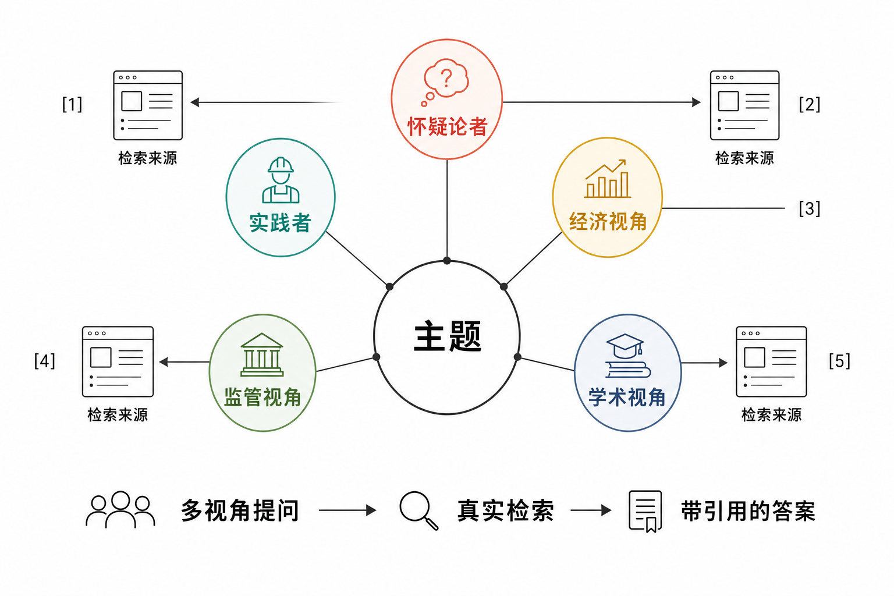
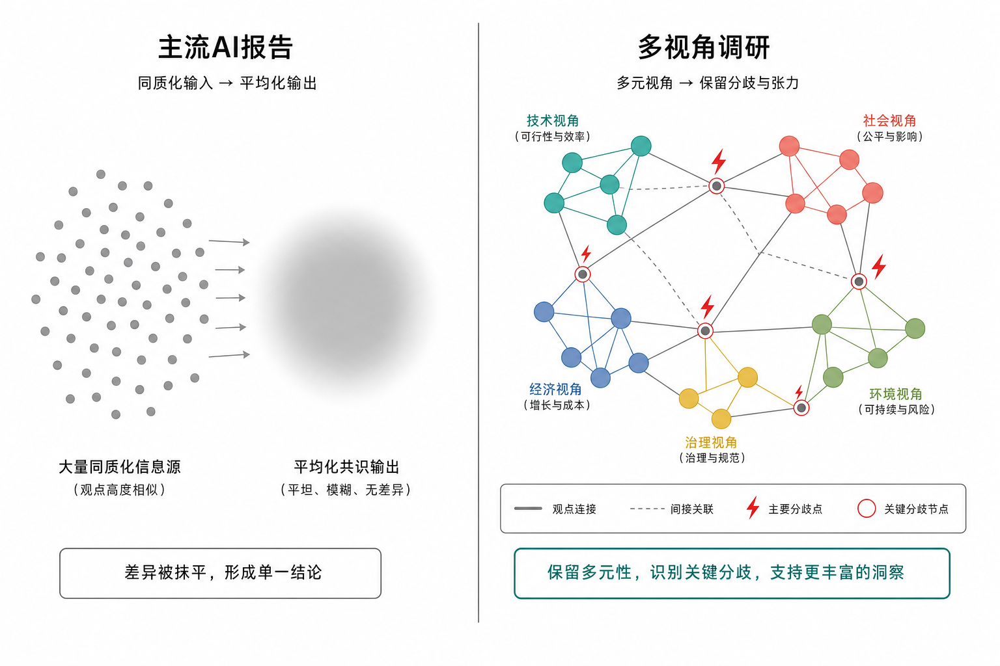
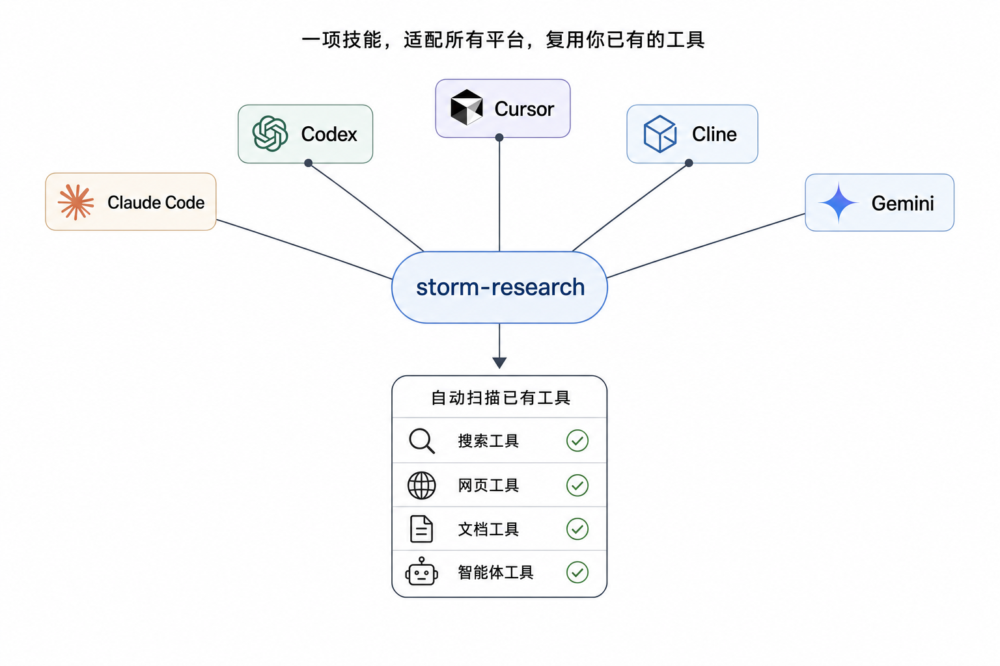
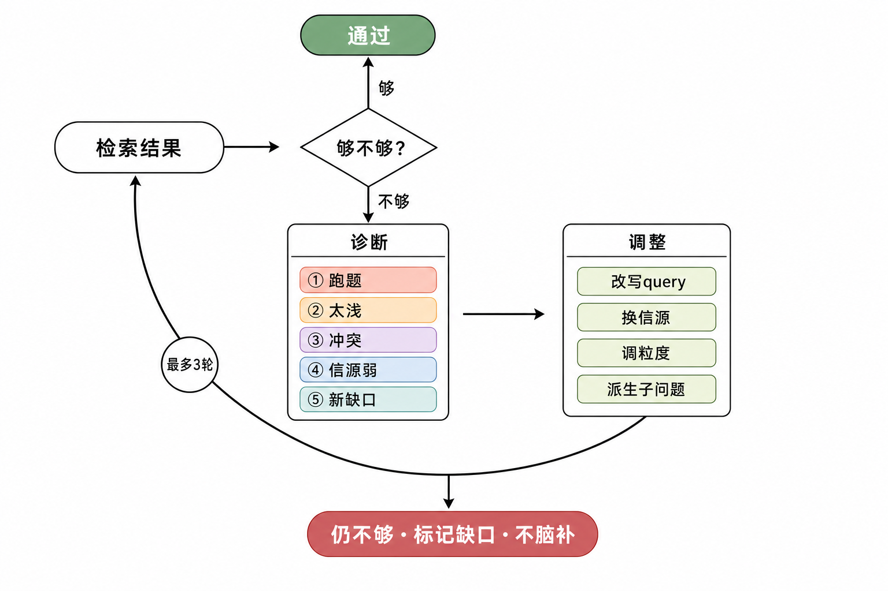

# storm-research

> 跨平台的 AI 深度研究 skill：多视角提问 + 真实联网检索 + 强制引用，产出维基百科式、每句话可追溯到来源的研究报告。

storm-research 是一个 **agent skill**，把"做一次有来源、可追溯的深度调研"沉淀成一套可复用的流程。它的核心信念是：**研究的瓶颈不是"写"，而是"问"**。直接把主题丢给大模型，只会得到主流框架下的平均答案；这套方法让模型像博士生做预调研那样工作——从多个对立视角反复追问，每个回答都用真实检索接地，每句话都能溯源。

方法思想源自斯坦福 OVAL 实验室的 **STORM** 研究（见文末「来源与引用」），并在其基础上做了面向真实 agent 环境的工程化扩展：跨平台检索能力自动发现、检索韧性兜底、双引擎广度、过程可见性契约。



---

## 按规模执行

简单问题可直接检索答复，中等比较只加载相关模块，完整多视角流程用于确有需要的深度研究。八步是可选方法模块，不是每次必经步骤。只读任务在对话交付即可；不要求写文件、原始工具输出或固定报告骨架。当前执行规则以 [SKILL.md](SKILL.md) 为准。

## 核心功能

- **🔭 自动扫描检索能力（Step 0）** — 研究开始前，按当前问题选择真实可用的相关工具或专用 skill，不全目录遍历；只有任务需要且宿主允许才派发子 agent。
- **🧭 跨平台兼容** — 兼容 Claude Code / Codex / OpenClaw / Hermes / Cursor / Cline / Gemini / OpenCode 等主流 agent。各平台 skill/agent 存放位置不同，skill 用"方法不变、只换目录"的路径表自动适配。
- **🎭 多视角提问（方法的灵魂）** — 围绕主题生成一组**互相对立**的研究者视角（实践者 / 怀疑论者 / 经济视角 / 学术视角…），视角间的冲突暴露单一框架永远看不到的东西。
- **📐 双引擎广度** — 对立视角负责"深层 + 跨框架"的覆盖，另设一个**覆盖视角**做系统性话题分解（吸收 query decomposition 的机械完整性），保证平淡但必要的基础话题不被漏掉。
- **🔗 检索接地 + 强制引用（抗幻觉红线）** — 每个论断必须基于真实检索回来的内容，按宿主与用户要求提供可核对的来源引用。检索不到就明确写"无法回答"，**禁止用模型记忆补全**。
- **🛡️ 检索韧性兜底** — 某个搜索工具返回空/失效时不停摆：自动换下一个工具、对权威域名直接抓正文、或派发带检索能力的子 agent，逐级降级。
- **⚖️ 矛盾图与缺口发现** — 跨视角提炼专家分歧、共识与领域盲区，把"表面理解"升级为"真正理解"。
- **👁️ 过程可见性契约** — 多步骤研究按宿主要求提供紧凑进度，只报告有意义的发现和下一步，不让多步 + 多子 agent 的研究退化成黑箱。
- **🔍 自我同行评审** — 报告产出后自查强/弱论点、潜在偏见、缺失角度、各来源可靠性，并诚实标注边界。



---

## 安装

将 skill 目录放到你所用 agent 平台的 skills 目录下即可。以 Claude Code 为例：

```bash
git clone https://github.com/openwhat007/storm-research.git
cp -R storm-research ~/.claude/skills/storm-research
```

其他平台把目标目录换成对应位置（如 Codex `~/.codex/skills/`、OpenClaw `~/.openclaw/skills/`、Cursor `~/.cursor/skills/` 等）。



> 前提：当前 agent 环境需具备至少一种联网/检索能力（内置搜索、检索类 skill、或可派发的检索子 agent）。若完全没有，skill 会在 Step 0 早失败并据实告知，不做无来源的"伪研究"。

---

## 使用

在支持 skill 的 agent 里，直接用自然语言触发：

```
深度调研一下「NMN 能抗衰老吗」
帮我研究 X 这个主题，要带来源
写一篇关于 Y 的多角度综述
```

skill 会按 Step 0 + 8 步流水线推进，过程中按可见性契约逐步把视角、问题、检索分工、矛盾图展示给你，最后产出完整报告。

### 产出物

一篇 markdown 研究报告，包含：

1. `# 摘要` 引导段
2. 多视角覆盖的正文，每个论断带 `[n]` 内联引用
3. `## 矛盾分析` —— 专家分歧与领域缺口
4. `## 参考来源` —— 编号对应的真实 URL 列表
5. `## 自查报告` —— 强/弱论点、偏见、缺失角度、可靠性评分

---

## 工作流程

```
Step 0  检索能力探测（一次性）   自动扫描工具/skill/agent，列出可用检索通道
  │
阶段一 · 知识采集（方法的灵魂）
  ├─ Step 1  视角发现           对立视角 + 覆盖视角
  ├─ Step 2  带视角提问 / 话题分解
  └─ Step 3  检索 · 反思 · 作答（agentic 闭环）  搜→判断够不够→不够则诊断·调整·再搜→带证据作答
  │
阶段二 · 综合与组织
  ├─ Step 4  矛盾图 / 缺口发现
  └─ Step 5  两步法大纲（固定骨架：基础→机制→多视角→矛盾）
  │
阶段三 · 写作与交付
  ├─ Step 6  带引用写作（多视角层用「问题钩子 + 带源回答」）
  └─ Step 7  自我同行评审
```

每步的提示词内核在 [`prompts/`](prompts/) 下；方法论原理见 [`reference/methodology.md`](reference/methodology.md)，agentic 反思补搜见 [`reference/agentic-retrieval.md`](reference/agentic-retrieval.md)。

---

## 三根支柱（缺一根就退化）

1. **多视角** — 不同视角制造问题的广度与深度，冲突暴露盲区。
2. **检索接地** — 每个回答必须基于检索取回的真实内容，无来源就拒答。
3. **强制引用** — 正文内联 `[n]`，文末列真实 URL，全程可追溯。

> **红线**：跳过检索，就不再是研究，而是让一个模型扮演几个角色自说自话——它们共享同一套盲区，会满怀自信地一起幻觉。宁可慢，不可省。

---

## Agentic 检索：不够时怎么办

检索接地这根支柱真正难的地方，不在"搜一次"，而在**搜完之后判断证据够不够、不够时该怎么调整再搜**。这是 naive RAG 与 agentic search 的分界线。storm-research 把它做成一个闭环：对每个子问题「搜 → 判断够不够 → 不够则诊断 → 调整再搜」，最多 3 轮，到顶仍不够就诚实标注缺口、绝不脑补。



核心纪律是：**「不够」不是一个布尔值，是一份诊断**。判定不够却把同一个 query 再搜一遍，等于空转烧 token——和漏搜一样是失败。所以反思必须输出"差在哪 + 做什么调整"，新 query 必须由缺口驱动而非重复原 query。原理与一手来源（Self-RAG / CRAG / FLARE / IRCoT / Adaptive-RAG）见 [`reference/agentic-retrieval.md`](reference/agentic-retrieval.md)。

---

## 适用与不适用

| 适合 | 不适合 |
|---|---|
| 有争议、有利益纠葛的主题（保健品/投资/新技术吹捧） | 查一个事实、API、定义 |
| 需要看分歧、风险、非共识判断的决策类调研 | 只要一句话概览 |
| 要求每个论断可溯源的综述 | 追求极致速度、不在意来源 |

storm-research 定位是**写作前的高质量预调研**——给你一个有来源、有结构、暴露了分歧和盲区的起点，而非可直接交付的终稿。重大决策仍需结合一手调研和人的判断。

---

## 贡献

欢迎提 PR 持续迭代，见 [CONTRIBUTING.md](CONTRIBUTING.md)。本项目核心是"打磨提示词与流程"，多数规则来自实跑暴露的失败模式，提改动时请说明解决的具体问题。

---

## 来源与引用

本项目的方法思想源自斯坦福 OVAL 实验室的 **STORM**（Synthesis of Topic Outlines through Retrieval and Multi-perspective Question Asking）：

- 原项目仓库：<https://github.com/stanford-oval/storm>
- 论文：Yijia Shao, Yucheng Jiang, Theodore Kanell, Peter Xu, Omar Khattab, Monica Lam. *Assisting in Writing Wikipedia-like Articles From Scratch with Large Language Models.* NAACL 2024. arXiv:[2402.14207](https://arxiv.org/abs/2402.14207)

```bibtex
@inproceedings{shao-etal-2024-assisting,
    title = "Assisting in Writing {W}ikipedia-like Articles From Scratch with Large Language Models",
    author = "Shao, Yijia and Jiang, Yucheng and Kanell, Theodore and Xu, Peter and Khattab, Omar and Lam, Monica",
    booktitle = "Proceedings of the 2024 Conference of the North American Chapter of the Association for Computational Linguistics: Human Language Technologies (Volume 1: Long Papers)",
    month = jun,
    year = "2024",
    address = "Mexico City, Mexico",
    publisher = "Association for Computational Linguistics",
    url = "https://aclanthology.org/2024.naacl-long.347/",
    doi = "10.18653/v1/2024.naacl-long.347",
    pages = "6252--6278",
}
```

> storm-research 是一个独立的 agent skill 实现，借鉴了 STORM 的核心思想（多视角提问 + 检索接地），并针对真实 agent 环境做了工程化扩展。它不隶属于斯坦福 OVAL，也不是 STORM 官方项目的衍生代码。所有权威方法学请以上述原始论文与仓库为准。

---

## 许可证

[MIT](LICENSE) © 2026 openwhat007
